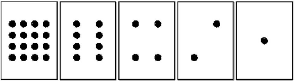

# Le Binaire

{: .center}


_Règle du jeu :_ Disposer les cartes ci-dessous dans l’ordre sur la table. Vous ne pouvez que retourner ou non chaque carte. Il s'agit ensuite de compter le nombre de points visibles.

{: .center}

## 1. Jouons avec des cartes
:arrow_forward: A tour de rôle, demander à votre binôme d’afficher un entier choisi au hasard (ex :  6 , 21, 15 …)

:question: Existe-t-il un nombre qui peut être représenté de 2 façons différentes avec les cartes ?

??? "Réponse"
	Il n'existe qu'une et une seule façon de représenter un entier

:question: Peut-on afficher n'importe quel entier ? 
??? "Réponse"
	on peut représenter l'ensemble des entiers jusqu'à un certain maximum

:question: Quel est le maximum ?  
??? "Réponse"
	16 + 8 + 4 + 2 + 1 = 31 <br />

:arrow_forward:Compter à partir de 0 et essayer de repérer le mécanisme de progression.

## 2. Passons au binaire
Pour chaque carte,  on note 1  si elle est tournée du côté visible (recto) et   on note 0  si la face est invisible (côté verso).
:question: Quel nombre est représenté par le mot  01001 ? 
??? "Réponse"
	9
:question: Quel nombre est représenté par le mot  00000 ? 
??? "Réponse"
	zéro
:question: Quel nombre est représenté par le mot  11111 ? 
??? "Réponse"
	31

:question: Comment écrit-on 17 en binaire ?  
??? "Réponse"
	10001


!!! warning "A retenir" 
	Le système binaire est un système de numération de **position** de base deux : les deux seuls chiffres qui le composent sont le `0` et le `1`. Le système binaire est le "langage" des ordinateurs. Toutes les machines numériques utilisent le système binaire pour coder des informations (textes, sons, images, vidéos…). L'ordinateur communique avec le monde extérieur en envoyant des informations sous la forme de nombres binaires à 8 bits appelés octets.<br />
	:bulb: Un octet (Byte) représente 8 bits (BInary digiT)


## 3. Le système binaire

!!! note ""
	Chaque carte représente en fait un **"bit"** (binary digit). Un ensemble de bits est appelé un **« mot ».**  <br />
	- Il existe 256 mots de 8 bits <br />
	- Ces mots codent les entiers de 0  à 255     <br />
	- Un mot de 8 bits s’appelle  un octet<br />
	- Le bit le plus à gauche est nommé **bit de poids fort**
	
### 3.1 Du binaire vers le décimal	

et si on passait en système Décimal ….

|...|128|64|32|16|8|4|2|1|
|:---:|:---:|:---:|:---:|:---:|:---:|:---:|:---:|:---:|
|...|$2^7$|$2^6$|$2^5$|$2^4$|$2^3$|$2^2$|$2^1$|$2^0$|
|...|1|1|0|1|0|0|1|0|

 $11010010_2=1 \times 2^7+ 1 \times 2^6+0 \times 2^5+1 \times 2^4+0 \times 2^3+0 \times 2^2+1 \times 2^1+0 \times 2^0=128+64+32+2=210_{10}$
 
 Le nombre binaire `11010010` correspond donc au nombre décimal `210`.
 

!!! note "Code Python"
    En Python, on peut utiliser la fonction `int("nombre", base)`.
    ```python
    >>> int("11010010", 2)
    210
    ```

### 3.2 Du decimal vers le binaire		

Principe : dans chaque nombre décimal, il existe une plus grande puissance de 2 qui est inférieure au nombre. 

Par exemple, dans 243, il y a 128. Donc   
$243=128 + (115)$   
$243=128+64+(51)$     
$243=128+64+32+(19)$    
$243=128+64+32+16+(3)$   
$243=128+64+32+16+2+1$  
$243=1 \times 2^7+ 1 \times 2^6+1 \times 2^5+1 \times 2^4+0 \times 2^3+0 \times 2^2+1 \times 2^1+1 \times 2^0$

Donc $243_{10}=11110011_2$

**Méthode des divisions successives**

{: .center}

!!! note "Code Python"
    En Python, on peut utiliser la fonction `bin(nombre)`. Elle renvoie une chaîne de caractère où le nombre binaire est précédé de `'0b'`.
    ```python
    >>> bin(243)
    '0b11110011'
    ```

!!! note "Définition"
	- **Codage :** Opération consistant à représenter des informations à l'aide d'un code.<br />
	- **Codage binaire :** Le code binaire utilise exclusivement les symboles 0 et 1 (systèmes logiques).<br />
	- **Bit :** C'est le chiffre élémentaire de la numérotation binaire.<br />
	- **Mot :** Groupe de "n" bits; un mot de 4 bits s'appelle un quartet, 8 bits s'appelle un octet...<br />
	- **Poids :** Coefficient attaché au rang d'un chiffre dans un système de numérotation. En numérotation binaire, on parle du bit de plus faible poids qui est la position binaire de droite dans un mot et du bit de plus fort poids qui représente le bit situé le plus à gauche dans mot.

## 4. L'hexadécimal

### 4.1 Présentation

Les nombres en binaires sont longs. On utilise souvent la base 16 pour les manipuler plus facilement.<br />
En hexadécimal, on utilise 16 symboles **0 1 2 3 4 5 6 7 8 9 A B C D E F** :

| | | | | | | | | | | | | | | | | |
|:--:|:--:|:--:|:--:|:--:|:--:|:--:|:--:|:--:|:--:|:--:|:--:|:--:|:--:|:--:|:--:|:--:|
|Hexa| 0 |1| 2| 3| 4| 5| 6| 7| 8| 9| A| B| C| D| E|F|
|Décimal| 0 |1| 2| 3| 4| 5| 6| 7| 8| 9| 10| 11| 12| 13| 14 |15|


### 4.2 de l'hexa vers le binaire et inversement

Convertir un binaire en hexa est facile. Chaque paquet de 4 bits donne un chiffre hexa :

|binaire|Hexa|décimal|
|:--:|:--:|:--:|
|0000|0|0|
|0001|1|1|
|0010|2|2|
|0011|3|3|
|...|...|...|
|1001|9|9|
|1010|A|10|
|1011|B|11|
|1100|C|12|
|1101|D|13|
|1110|E|14|
|1111|F|15|


Pour convertir un nombre binaire en base 16, on regroupe les bits 4 à 4, chaque groupe donnant un chiffre hexadécimal. À l'inverse, passer d'un nombre hexadécimal à sa représentation binaire se fait en remplaçant chaque chiffre pour son équivalent sur 4 bits. Ainsi, $(11011001)_{2}=(1101 1001)_{2}=(D9)_{16}$, tandis que $(7F)_{16}=(0111 1111)_{2}=(01111111)_{2}$.

:question: Combien vaut $(1010 0011 1011 11002)_{2}$ ?
??? question "correction" 

	$(A3BC)_{16}$

:warning: Si le nombre binaire de départ n'a pas un nombre de bits multiple de 4, il faut ajouter des zéros en tête (ce qui ne change pas sa valeur) afin de pouvoir les regrouper 4 par 4.

### 4.3 Convertir un nombre décimal en hexadécimal

Pour convertir un nombre décimal en hexadécimal, la méthode est similaire au binaire, sauf que cette fois on divise par **16**.

$185 = 16 * 11 + 9$ (reste **9**)<br />
$11 = 16 * 0 + 11$ (c'est à dire **B**)<br />

Attention, il faut bien lire de bas en haut !<br />
**185** en base 10 vaut donc **B9** en hexadécimal.

### 4.4 Convertir un nombre hexadécimal en décimal

Le principe est le même que pour la conversation "binaire en décimal" sauf qu'au lieu d'utiliser des $2^n$ on utilise des $16^n$:<br />

exemple : $12B716 = 1*16^3 + 2*16^2 + 11*16^1 + 7*16^0 = 1*4096 + 2*256 + 11*16 + 7= 4096 + 512 + 176 + 7 = 4791$

Vous avez remarqué que quand on trouve un **B** dans le nombre écrit en hexadécimal, on le remplace par un **11** dans le calcul. C'est exactement la même chose quand on trouve :

un A, on le remplace par un 10 <br />
un C, on le remplace par un 12 <br />
un D, on le remplace par un 13 <br />
un E, on le remplace par un 14 <br />
un F, on le remplace par un 15 <br />

!!! info "Python"
	
	Les nombres binaires et hexadécimaux sont représentés en Python sous forme de chaîne de caractères avec un préfixe.<br />

	- ``Ob`` pour les nombres binaires par exemple ``0x1001`` pour 10012
	- ``Ox`` pour les nombres hexadécimaux par exemple ``0xABCD`` pour ABC16