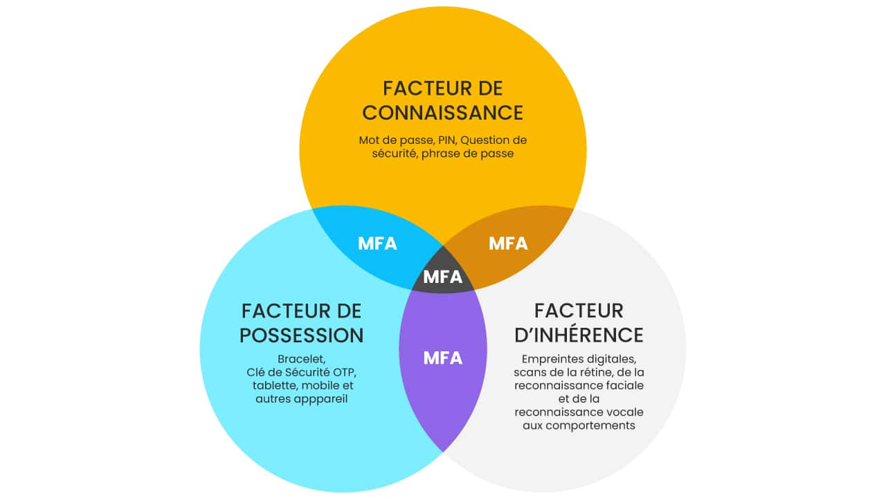
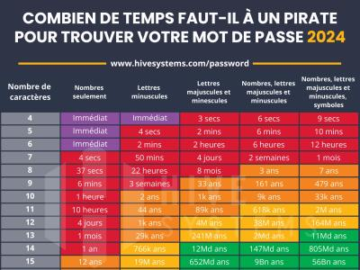
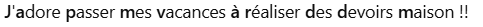

# Phrase de passe ⚓️ Cyber

??? note "Source"
    - Contenu extrait du MOOC [SecNumAcadémie](https://secnumacademie.gouv.fr/) de l’[ANSSI](https://cyber.gouv.fr/)
    - [CNIL](https://www.cnil.fr/)
    - Activité CNIL : Hélène Passelande

## A quoi sert un mot de passe ?

• **Accès** à des services en ligne grâce au contrôle d’accès.<br/>
• **Imputabilité**, preuve de qui a fait quoi.<br/>
• **Traçabilité** des actions, historique des actions.<br/>

Exemple, <br/>
^^télédéclaration de l’impôt :^^ imputabilité = lien entre la déclaration et la personne *ET* traçabilité = connaître l’heure et la date de la déclaration.

## un mot de passe, c'est 

• La connaissance :point_right: JE CONNAIS<br/>
• La possession :point_right: JE POSSEDE<br/>
• Les caractéristiques biométriques :point_right: JE SUIS<br/>

{: .center width=90%}

## Les risques 

• **Divulgation :**<br/>

> - Par négligence : faiblesse d’une personne, support amovible, diffusion à un tiers.<br/>
> - Par un service non sécurisé : protocoles https, imaps, pop3s, etc… à privilégier.<br/>
> - Par l’utilisation d’un vecteur infecté.<br/>
> - Mot de passe enregistré sans protection.<br/>

• **Malveillance :**<br/>

> - Authentification sur un service illégitime.<br/>
> - Attaque par ingénierie sociale, piège.<br/>
> - Attaque par force brute ou divulgation d’une base de données mal sécurisée.<br/>

• Ces deux cas de figure peuvent entraîner :<br/>

> - La compromission des messages personnels.<br/>
> - La destruction de données.<br/>
> - La publication de messages ou photos préjudiciables sur les réseaux sociaux par exemple.<br/>
> - Des achats.<br/>
> - Des virements bancaires.<br/>

## Craquer un mot de passe

- Par **force brute**<br/>
- Par **dictionnaire**, en général avant l’attaque par force brute<br/>
- Par **permutation** en échangeant des caractères (exemple : E par 3 ou O par 0).<br/>

## Mais un souci de temps

une image plutôt qu'un long discours :

{: .center width=50%}

## Comment construire un mot de passe fort ?

Le mot de passe doit apporter un niveau de sécurité suffisant, c’est-à-dire difficile à découvrir par un attaquant dans un temps raisonnable à  l’aide d’outils automatisés de recherche qui mettent en oeuvre les différentes techniques d’attaque. Il doit être composé au minimum de *10 caractères* et ceux-ci doivent être de tout type.

!!! info "Préconisations ANSI"
    Créez un mot de passe suffisamment long, complexe et inattendu : de 8 caractères minimum et contenant des minuscules, des majuscules, des chiffres et des caractères spéciaux. [source](https://cyber.gouv.fr/bonnes-pratiques-protegez-vous)

Quelques astuces : 

- Grâce à une [phrase de passe](https://www.cnil.fr/fr/generer-un-mot-de-passe-solide) avec des mots concaténés.
- Par phonétique.
- Les premières lettres des mots d’une phrase, citation, chanson, etc…
- Mixer les trois méthodes.

!!! note "Activité Phrase de passe"

    🔽 Télécharger le notebook Activité correspondant [ici](./data/phrase_de_passe-v2.ipynb)<br />
    
!!! warning "Scénario"
    Un utilisateur souhaite construire un mot de passe fort pour sécuriser un document.

## Construire un mot de passe assez fort et facilement mémorisable.

### Description

Pour construire un mot de passe assez fort et facilement mémorisable, une technique consiste à retenir les initiales des mots d'une phrase de passe.  <br />
Par exemple : 
{: width=80% .center}

**Donne :** Japmvàrddm  <br />
<br />
Pour augmenter la sécurité du mot de passe, on peut décider de mettre aléatoirement certaines lettres en majuscules.  Attention pour que le mot de passe reste facile à écrire au clavier, on n'aura pas de majuscules accentuées ! <br /> 
**Cela donne :** JApMvARDdm  

Pour augmenter encore la sécurité, on décide de mettre un chiffre au hasard dans le mot de passe.  <br />
**Ca donne :** JAp5MvARDdm  

### Les étapes de construction

Un utilisateur saisit un chiffre et une phrase de passe.   

- On vérifie que le chiffre est bien un entier entre 0 et 9. 
- On transforme les apostrophes et les signes de ponctuation en espace  
- On vérifie qu'il y a plus de 8 mots séparés par des espaces
  
Pour obtenir le mot de passe  :

- on récupère la première lettre de chaque mot
- on convertit les lettres accentuées en lettres non accentuées
- si la lettre est minuscule, on la convertit au hasard en minuscule ou majuscule
- on ajoute au hasard le chiffre quelque part dans la chaine de caractères.  

# Au travail !

Compléter la fonction `convertir_ponctuation` qui convertit les apostrophes et les signes de ponctuation de la phrase en espaces.

```python
def convertir_ponctuation(phrase) :
    """
    convertir les apostrophes et les signes de ponctuation de la phrase en espaces
    @param :  phrase--> str : phrase saisie par l'utilisateur
    @return : str : phrase saisie par l'utilisateur avec des espaces à la place des apostrophes et des signes de ponctuation
    
    EXAMPLES 
    --------
    >>> convertir_ponctuation("J'adore passer mes vacances à réaliser des devoirs maison.")
    "J adore passer mes vacances à réaliser des devoirs maison"
    
    >>> convertir_ponctuation("J''aime avec une faute de frappe")
    "J  aime avec une faute de frappe"

    >>> convertir_ponctuation("Voilà : écoute, ce que je te dis !")
    "Voilà   écoute  ce que je te dis  "
    """
    phrase_sans_ponctuation = ""
    for i in range(len(phrase)) :
        if phrase[i] in ["'",":",",",";","!",".","?"] :
            phrase_sans_ponctuation = # à compléter
        #à compléter
```
??? question "Correction"

    ```python
    def convertir_ponctuation(phrase) :
        """
        convertir les apostrophes et les signes de ponctuation de la phrase en espaces
        @param :  phrase--> str : phrase saisie par l'utilisateur
        @return : str : phrase saisie par l'utilisateur avec des espaces à la place des apostrophes et des signes de ponctuation
    
        """
        phrase_sans_ponctuation = ""
        for i in range(len(phrase)) :
            if phrase[i] in ["'",":",",",";","!",".","?"] :
                phrase_sans_ponctuation = phrase_sans_ponctuation + " "
            else :
                phrase_sans_ponctuation = phrase_sans_ponctuation + phrase[i]
        return phrase_sans_ponctuation
    ```

Pour chaque fonction, vous devez tester les exemples proposés avant de poursuivre en ajoutant des tests.


```python
# tester les trois exemples proposés
convertir_ponctuation("J'adore passer mes vacances à réaliser des devoirs maison.")
```

??? question "Correction"

    ```python
    convertir_ponctuation("J''aime avec une faute de frappe")
    convertir_ponctuation("Voilà : écoute, ce que je te dis !")
    ```

Il faut maintenant vérifier que la phrase contient **plus de 8 mots**.  
Pour compter le nombre de mots, on va compter le nombre de fois où on trouve un caractère qui est un espace suivi d'un caractère qui n'est pas un espace.  
Dans ce cas, pour détecter le premier mot, il faut ajouter un espace au début de la phrase s'il n'y en a pas.  

En suivant cette règle, compléter la fonction `verifier_plus_de_huit_mots`.


```python
def verifier_plus_de_huit_mots(phrase) :
    """
    vérifier que la phrase contient plus de 8 mots
    @PARAM: phrase --> str : phrase saisie par l'utilisateur où il n'y a plus de ponctuation et chaque mot est séparé par des espaces
    
    @RETURN : bool : vrai si la phrase contient plus de 8 mots
    
    EXAMPLES 
    --------
    >>> verifier_plus_de_huit_mots("C est trop court")
    False
    >>> verifier_plus_de_huit_mots("C est trop         court")
    False
    >>> verifier_plus_de_huit_mots("J adore passer mes vacances à réaliser des devoirs maison")
    True
    """
    # on ajoute un espace pour premier caractère s'il n'y en pas pas
    if phrase[0] != ' ':
        # à compléter
        
    nb_mots = 0
    
    # pour compter le nombre de mots, on cherche le début de chaque mot
    # en testant chaque caractère de la phrase,
    # on détecte le début d'un mot parce qu'il contient un espace suivi d'une lettre 
    for i in range(len(phrase)-1):
        if phrase[i] == ' ' and phrase[i+1] != ' ' :
            # à compléter
            
            
    if nb_mots < 8 :
        # à compléter
        
```
??? question "Correction"

    ```python
    def verifier_plus_de_huit_mots(phrase) :
        # on ajoute un espace pour premier caractère s'il n'y en pas pas
        if phrase[0] != ' ':
            phrase =  ' ' + phrase
        # pour compter le nombre de mots, on cherche le début de chaque mot
        # en testant chaque caractère de la phrase,
        # on détecte le début d'un mot parce qu'il contient un espace suivi d'une lettre 
        nb_mots = 0
        for i in range(len(phrase)-1):
            if phrase[i] == ' ' and phrase[i+1] != ' ' :
                nb_mots = nb_mots + 1
        #debug
        #print("nb mots ", nb_mots)
        if nb_mots < 8 :
            return False
        else :
            return True
    ```

On vérifie que le chiffre est bien un entier entre 0 et 9.  
Compléter la fonction `verifier_chiffre`.

```python
def verifier_chiffre(chiffre) :
    """
    vérifier que le chiffre est bien un entier entre 0 et 9.
    @PARAM : chiffre --> int : chiffre saisi par l'utilisateur
    @RETURN : bool : vrai si le chiffre est bien un entier entre 0 et 9.
    
    EXAMPLES 
    --------
    >>> verifier_chiffre(5.3)
    AssertionError: Il faut donner un nombre entier !
    >>> verifier_chiffre(7)
    True
    >>> verifier_chiffre(10)
    AssertionError: Il faut nombre entier entre 0 et 9 !
    """
    # à compléter
```

??? question "Correction"

    ```python
    def verifier_chiffre(chiffre) :
        assert type(chiffre) == int , "Il faut donner un nombre entier !"
        assert 0 <= chiffre <= 9, "Il faut nombre entier entre 0 et 9 !"
        return True
    ```


Il faut maintenant récupérer les initiales de chaque mot pour créer la première version du mot de passe.  
On détecte la première lettre de chaque mot de la même façon que pour la fonction `verifier_plus_de_huit_mots`.  
Puis, on crée un algorithme de cumul qui concatène les premières lettres de chaque mot.


```python
def obtenir_premieres_lettres(phrase):
    """
    créer un mot constitué des premières lettres de chaque mot de la phrase
    @PARAM : phrase --> str : phrase saisie par l'utilisateur où chaque mot est séparé par des espaces
    @RETURN : str : mot constitué des premières lettres de chaque mot de la phrase
    
    EXAMPLES 
    --------
    >>> obtenir_premieres_lettres("J adore passer mes vacances à réaliser des devoirs maison")
    Japmvàrddm
    >>> obtenir_premieres_lettres("Le petit chien s appelle            Idéfix")
    LpcsaI
    """
    # on ajoute un espace pour premier caractère s'il n'y en pas pas
    if phrase[0] != ' ':
        # à compléter
            
    mot_de_passe = ""
    
    # en testant chaque caractère de la phrase,
    # on détecte le début d'un mot parce qu'il contient un espace suivi d'une lettre 
    # dans ce cas, on concatène les premières lettres pour créer le mot de passe
    for i in range(len(phrase)-1):
        if phrase[i] == ' ' and phrase[i+1] != ' ' :
            # à compléter
                
    return mot_de_passe  
    
```

??? question "Correction"

    ```python
    def obtenir_premieres_lettres(phrase):
        # on ajoute un espace pour premier caractère s'il n'y en pas pas
        if phrase[0] != ' ':
            phrase =  ' ' + phrase
        
        mot_de_passe = ""
        
        # en testant chaque caractère de la phrase,
        # on détecte le début d'un mot parce qu'il contient un espace suivi d'une lettre 
        # on concatène les premières lettres pour créer le mot de passe
        for i in range(len(phrase)-1):
            if phrase[i] == ' ' and phrase[i+1] != ' ' :
                mot_de_passe = mot_de_passe + phrase[i+1]
                
        return mot_de_passe  
    ```

On suppose que l'utilisateur n'a pas utilisé de majuscule accentuée.  <br />
Pour convertir les minuscules accentuées en en leur équivalent non accentué :  <br />

1. Chercher toutes les minuscules accentuées possibles en français pour compléter la fonction `convertir_sans_accent`.
2. Dans cette fonction, on itère sur chaque caractère de `mot`.    

    1.  Si le caractère est une minuscule accentuée, on attribue à la variable `nv_caractère` l'équivalent non accentué du caractère.  
    2. Si le caractère n'est pas une minuscule accentuée, on attribue à la variable `nv_caractère` ce caractère.


```python
def convertir_sans_accent(mot):
    """
    convertir les lettres accentuées du mot en leur équivalent non accentué"
    @PARAM : mot --> str : une chaine de caractères
    @RETURN : str : la même chaine de caractères sans les accents
    
    EXAMPLES 
    --------
    >>> convertir_sans_accent("Japmvàrddm")
    Japmvarddm
    >>> convertir_sans_accent("àêïôù")
    aeiou
    """
    mot_sans_accent = ""
    for caractere in mot :
        # on étudie tous les cas possibles
        if caractere in ['à','â']:
            nv_caractere = 'a'
        elif  # à compléter
        
            
        #dans tous le cas, on ajoute le nouveau caractère à `mot_sans_accent`
        mot_sans_accent = mot_sans_accent + nv_caractere
    return mot_sans_accent
            
```

??? question "Correction"

    ```python
    def convertir_sans_accent(mot):
        mot_sans_accent = ""
        for caractere in mot :
            if caractere in ['à','â']:
                nv_caractere = 'a'
            elif caractere == 'ç':
                nv_caractere = 'c'
            elif caractere in ['é','è','ê','ë']:
                nv_caractere = 'e'
            elif caractere in ['î','ï']:
                nv_caractere = 'i'
            elif caractere == 'ô':
                nv_caractere = 'o'
            elif caractere in['ù','û','ü']:
                nv_caractere = 'u'
            else :
                nv_caractere = caractere
            mot_sans_accent = mot_sans_accent + nv_caractere   
        return mot_sans_accent
    ```

En utilisant le code ASCII, comment peut-on savoir si une lettre non accentuée est une majuscule ou une minuscule ? <br />
??? question "Réponse"
    
    En regardant le code ASCII, on peut voir que le code décimal de chaque lettre majuscule et minuscule a un écart de 32.  <br />
    Par exemple :  <br />
    A(65)  et a(97) : 97 - 65 = 32  <br />
    D(68) et d(100) : 100 - 68 = 32  <br />
    P(80) et p(112) : 112 - 80 = 32  <br />

    On peut donc convertir une minuscule en sa majuscule en otant 32 à son code décimal en ASCII.

Utiliser cette particularité du code ASCII pour compléter la fonction `convertir_majuscule_minuscule_aleatoire`.

```python
from random import randint

def convertir_majuscule_minuscule_aleatoire(lettre):
    """
    convertir aléatoirement une lettre minuscule en majuscule ou minuscule
    @PARAM : lettre --> str : une lettre non accentuée de l'alphabet
    @RETURN : str : la même lettre en majuscule ou en minuscule
    
    EXAMPLES 
    --------
    >>> convertir_majuscule_minuscule_aleatoire("a")
    a
    
    ou aléatoirement
    
    >>> convertir_majuscule_minuscule_aleatoire("a")
    A
    """
    # on choisit au hasard 0 ou 1
    alea = randint(0,1)
    # si le hasard a désigné 1 alors on convertit la lettre en majuscule
        # à compléter
            
    return lettre
```
??? question "Correction"

    ```python
    from random import randint

    def convertir_majuscule_minuscule_aleatoire(lettre):
        # on choisit au hasard 0 ou 1
        alea = randint(0,1)
        # si le hasard a désigné 1 alors on convertit la lettre en majuscule
        if alea :
            lettre = chr(ord(lettre)-32)
        return lettre
    ```

Compléter la fonction `modifier_mot_majuscule_minuscule(mot)` qui :

- itère sur chaque lettre du mot
- appelle, si la lettre est une minuscule, la fonction `convertir_majuscule_minuscule_aleatoire`
- renvoie un nouveau mot de passe avec des minuscules parfois modifiées en majuscules.

```python
def modifier_mot_majuscule_minuscule(mot):
    """
    convertir aléatoirement chaque lettre minuscule d'un mot en majuscule ou minuscule, 
    ne pas la modifier si elle est en majuscule
    @PARAM : mot --> str : une chaine de caractères de lettres non accentuées
    @RETURN : str : le même mot avec des majuscules et des minuscules aléatoires
    
    EXAMPLES 
    --------
    >>> modifier_mot_majuscule_minuscule("Japmvarddm")
    JApMvARDdm
    
    ou aleatoirement
    
    >>> modifier_mot_majuscule_minuscule("Japmvarddm")
    JaPMVarDDm
    >>> modifier_mot_majuscule_minuscule("ABCDefgh")
    ABCDeFgH
    """
    nv_mot = ""
    # on itère sur chaque lettre du mot 
    # à compléter
        
        # si la lettre est une minuscule
        # on convertit aléatoirement cette lettre en majuscule ou minuscule
        # on concatène le nouveau mot et cette nouvelle lettre 
        # à compléter
        
        
        
        # sinon on concatène `nv_mot` et cette lettre
        else :
            nv_mot = nv_mot + lettre
    return nv_mot
```

??? question "Correction"

    ```python
    def modifier_mot_majuscule_minuscule(mot):
        nv_mot = ""
        # on itère sur chaque lettre du mot 
        for lettre in mot :
            # si la lettre est une minuscule
            # on convertit aléatoirement cette lettre en majuscule ou minuscule
            # on concatène le nouveau mot et cette nouvelle lettre 
            if 97 <= ord(lettre) <= 122 : #97 <= ord(lettre) suffirait
                nv_lettre = convertir_majuscule_minuscule_aleatoire(lettre)
                nv_mot = nv_mot + nv_lettre
            # sinon on concatène le nouveau mot et cette lettre
            else :
                nv_mot = nv_mot + lettre
        return nv_mot
    ```

Compléter la fonction `ajouter_chiffre` qui améliore la sécurité du mot de passe en ajoutant le chiffre quelque part dans le mot.

```python
def ajouter_chiffre(mot,chiffre):
    """
    ajouter un chiffre quelque part dans le mot
    @PARAM : mot --> str : une chaine de caractères
             chiffre --> int : un chiffre
    @RETURN : str : le même mot mais avec un chiffre inséré quelquepart
    
    EXAMPLES 
    --------
    >>> ajouter_chiffre("JApMvARDdm",5)
    JApM5vARDdm
    
    ou aléatoiremment 
    
    >>> ajouter_chiffre("JApMvARDdm",5)
    JApMvARDdm5
    
    >>> ajouter_chiffre("aBcdEF",9)
    a9BcdEF
    """
```

??? question "Correction"

    ```python
    def ajouter_chiffre(mot,chiffre):
        max = len(mot)-1
        alea = randint(0,max)
        nv_mot = mot [:alea]+str(chiffre)+mot[alea:]
        return nv_mot
    ```

Le programme principal appelle toutes ces fonctions pour créer le mot de passe à l'aide de la saisie de l'utilisateur.

```python
###################################################
#####    PROGRAMME PRINCIPAL DE LA PHRASE     #####
###################################################
chiffre = int(input("Saisir un chiffre (pas un nombre !) : "))
if verifier_chiffre(chiffre) :
    verif = False
    while not verif :
        phrase = input("Saisir votre phrase de code de plus de 8 mots : ")
        phrase = convertir_ponctuation(phrase)
        verif = verifier_plus_de_huit_mots(phrase)
        if not verif :
            print("Votre phrase est trop courte.")
mot_de_passe = obtenir_premieres_lettres(phrase)
mot_de_passe = convertir_sans_accent(mot_de_passe)
mot_de_passe = modifier_mot_majuscule_minuscule(mot_de_passe)
mot_de_passe = ajouter_chiffre(mot_de_passe,chiffre)
print("Votre mot de passe est : ", mot_de_passe)
```
```prompt
Saisir un chiffre (pas un nombre !) : 4
Saisir votre phrase de code de plus de 8 mots : J'adore passer mes vacances à réaliser des devoirs maison.
Votre mot de passe est :  J4APMVARddm
```
