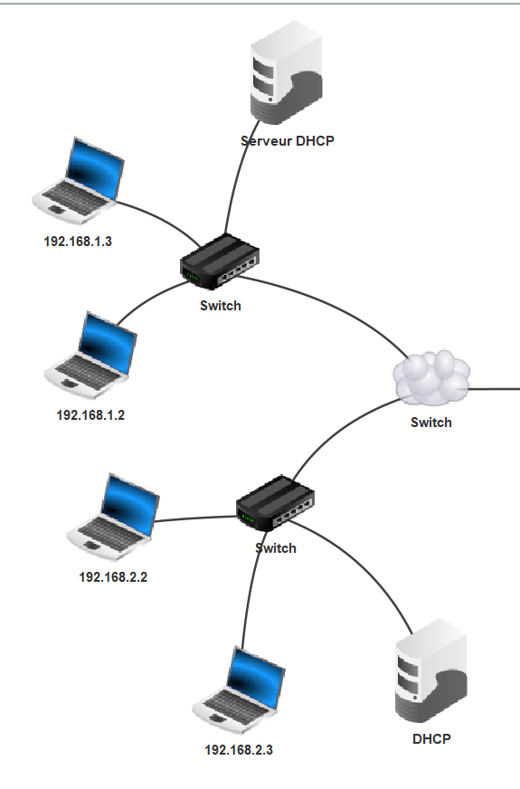
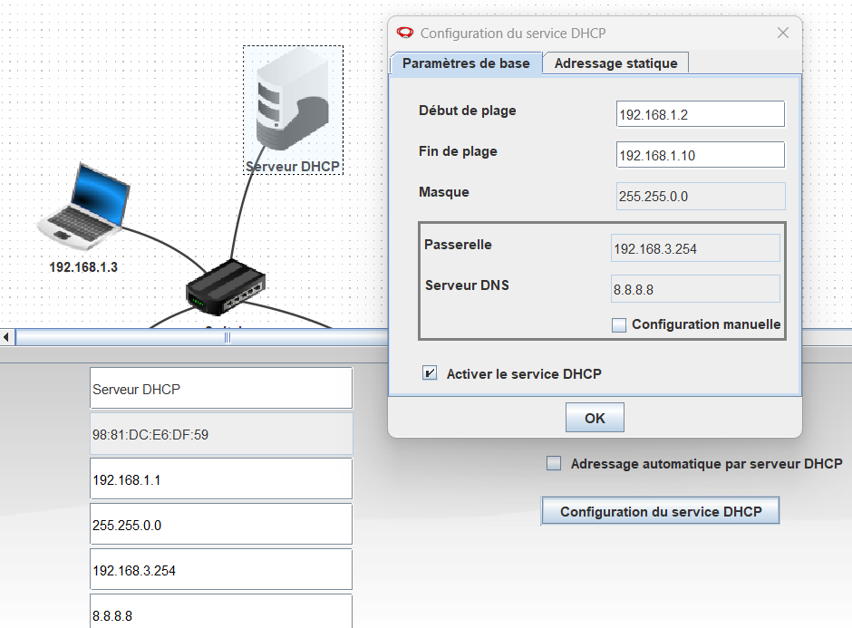
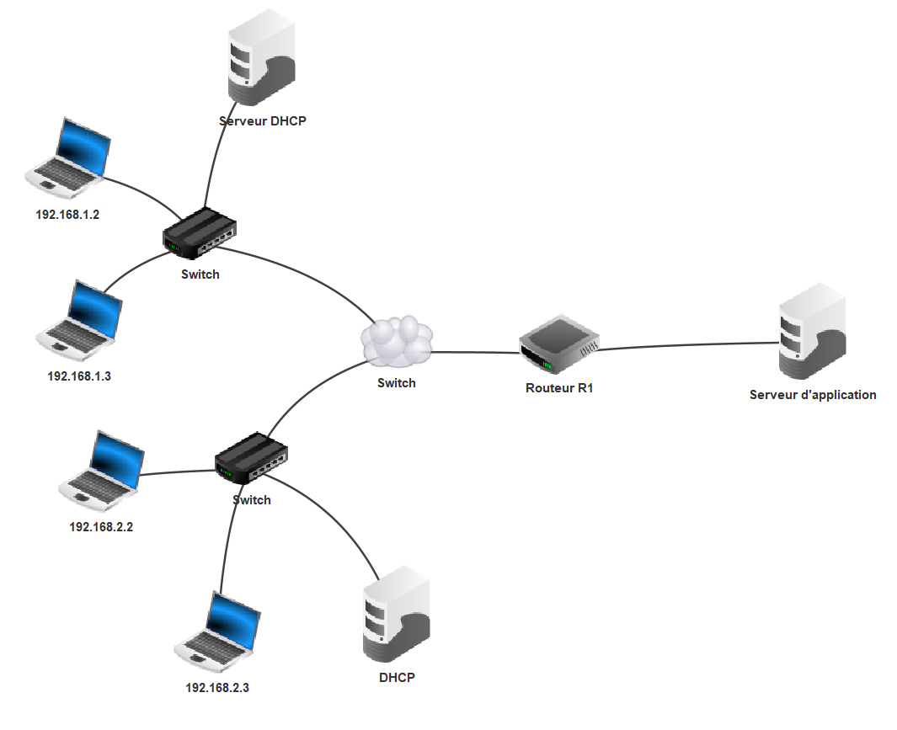
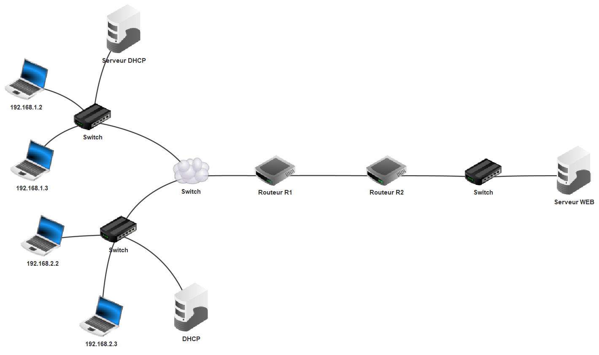
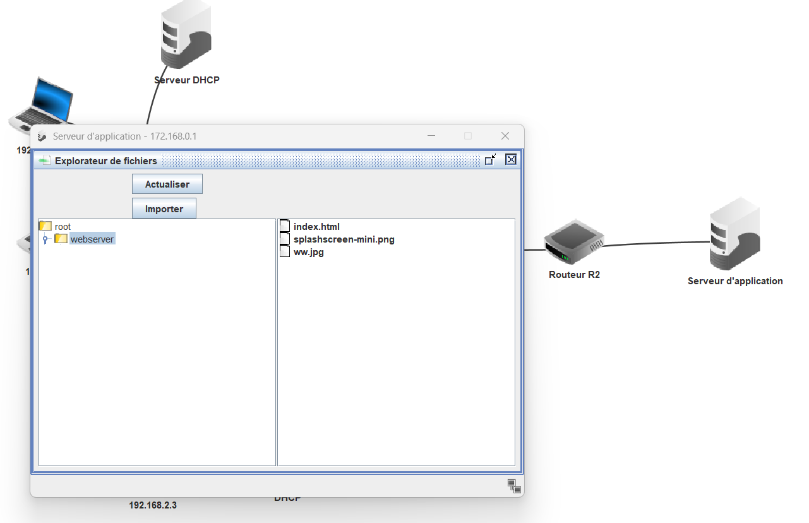
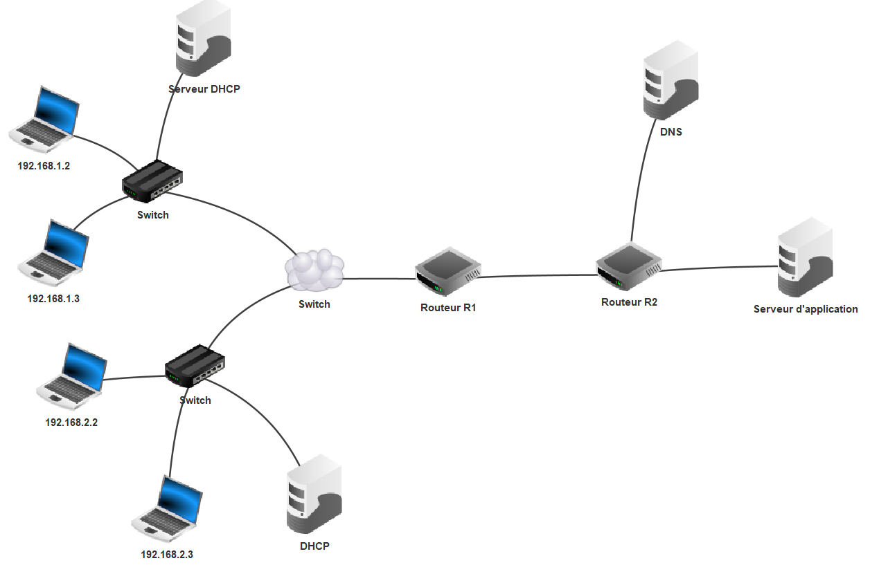
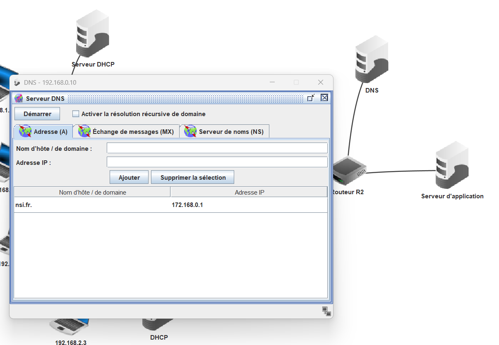
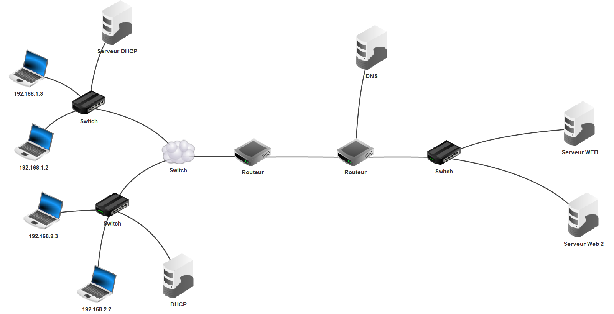
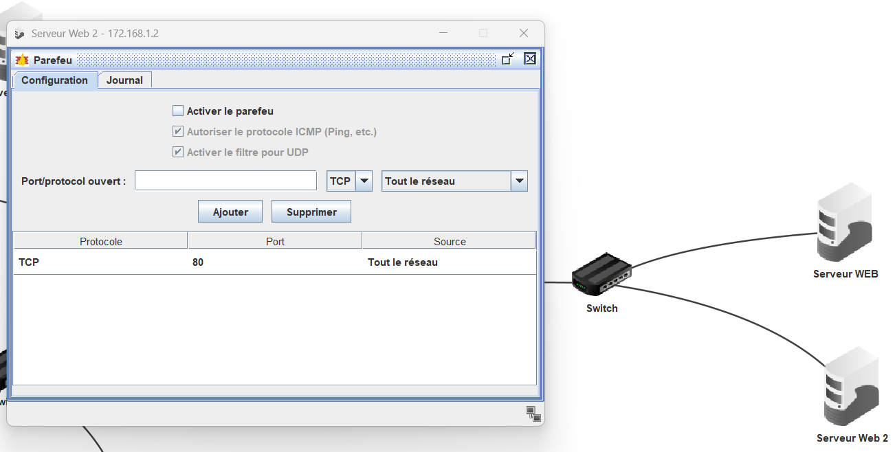

# TP Cyber réseau :anchor:

## Etape 1 : Construire le réseau : réseau local

#### La sécurité des communications numériques
La  sécurisation  des  communications  (acheminement  des  données)  dans  un réseau local implique l’utilisation de protocoles spécifiques et la mise en œuvre d’infrastructures réseaux particulières pour **segmenter** (diviser) de façon logique et physique le réseau interne. On va s'attarder ici sur la topologie d'un réseau, c'est à dire sur sa construction spatiale pour renforcer la sécurité d'un réseau.

#### Avantages de la segmentation ✂️

- Limiter le brouhaha réseau (ex : les trames de broadcast comme ARP).
- Séparer des services (serveur web, base de données, imprimantes, etc.).
- Renforcer la sécurité : un pirate qui accède à un segment ne voit pas les autres.

Comment segmenter un réseau ? 🧠

- Par adresse IP (plages IP différentes : 192.168.1.x / 192.168.2.x).
- Par VLAN (niveau 2 – commutateurs managés).
- Par routeurs ou firewalls.

!!! warning "Notion de VLANs"
    Un  VLAN  (Virtual  Local  Area  Network)  décrit  un  réseau local virtuel. Son  objectif est de regrouper de façon logique et indépendante un ensemble d’hôtes. Il permet de créer des domaines de diffusion gérés par les commutateurs indépendamment de l’emplacement géographique où se situe le nœud. 

!!! warning "📘 Notion de DHCP (Dynamic Host Configuration Protocol)"

    **Le DHCP est un protocole réseau** qui permet à un ordinateur ou tout autre appareil connecté à un réseau d’obtenir automatiquement une configuration IP valide (adresse IP, masque de sous-réseau, passerelle, DNS...).

    #### 🔧 Concrètement :

    Quand un appareil se connecte à un réseau (par câble ou Wi-Fi), il envoie une **demande DHCP**. Un **serveur DHCP** lui répond en lui attribuant une **adresse IP** et les paramètres nécessaires pour communiquer sur le réseau. C'est ce qui se passe quand vos tablettes sur le réseau du lycée. 
        
    #### 🧪 Exemple :

    Un élève allume son PC en salle info → la machine envoie une requête → le serveur DHCP du réseau lui attribue automatiquement l’adresse IP `192.168.1.25`, un masque `255.255.255.0`, et la passerelle `192.168.1.1`.

    **Note :** On définit pour le DHCP des plages d'adresses IP qu'il peut attribué. exemple : de 192.168.1.2 à 192.168.1.248. Et quand il n'y en a plus, ... il n'y en pas plus 🙀 et plus personne ne peut se connecter au réseau !

    #### ✅ Avantages :

    * Plus besoin de configurer manuellement chaque appareil.
    * Évite les conflits d’adresses IP.
    * Facilite la gestion des réseaux, surtout quand il y a beaucoup d’utilisateurs.

!!! exercice "partie 1 : VLAN avec DHCP"

    

    🚨 A FAIRE : contruire le réseau illustré ci-dessus  
    ⚠️ Les adresses IP indiquées sur le schéma ne sont pas paramétré "en dur" mais attribué par le DHCP sur une plage d'adresse IP. 
    ▶️ Vos deux réseaux 192.168.1.0 et 192.168.2.0 doivent pouvoir communiquer (vérifier avec la commande `ping`)

    ??? tips "**Aide 🚑 :** paramétrage sous filius"

        {: .center width=60%} 

On peut considérer le réseau (simplifié) comme un réeau d'entreprise avec deux services (exemple : marketing et production), il faut à présent que ces deux services puissent accéder à un serveur d'application (exemple : saisie des congés).

## Etape 2 : Construire le réseau : serveur d'application

!!! exercice "partie 2 : Serveur d'application"

    

    🚨 A FAIRE : contruire le réseau illustré ci-dessus  
    ⚠️ La passerelle sera indiqué dans le paramétrage du DHCP pour s'appliquer à l'ensemble des 2 VLANs 

    ▶️ Vos deux réseaux 192.168.1.0 et 192.168.2.0 doivent pouvoir communiquer avec le serveur d'application. (vérifier avec la commande `ping`)

    ??? tips "Correction étape 2"

        [⬇️ maquette filius après l'étape 2](./data/tp/segmentation_1_2.fls){: .center width=60%} 

Ce réseau n'est pas très sécurisé. Tout le monde au sein de l'entreprise peut avoir accès au contenu du serveur. Et surtout un attaquant ayant réussi à pénétrer un poste utilisateur pourra facilement remonter au serveur. On va essayer de lui compliqué un peu la tâche (technique de défense en profondeur) et d'isoler le serveur web dans un VLAN isolé.

??? info "Pour aller plus loin : DMZ"
    Une DMZ  ou **zone démilitarisée** est un réseau périmétrique qui protège et ajoute une couche de sécurité supplémentaire au réseau local interne d’une organisation contre le trafic non fiable. 
    L’objectif final d’un réseau de zone démilitarisé est de permettre à une organisation d’**accéder à des réseaux non fiables**, tels qu’Internet, tout **en s’assurant que son réseau privé ou son LAN reste sécurisé**. 
    
    Les organisations stockent généralement des services et ressources externes, ainsi que des serveurs pour le système de noms dedomaine (DNS), le protocole de transfert defichiers (FTP), la messagerie, le proxy, le protocole VoIP (Voice over Internet Protocol) et les serveurs Web, dans la DMZ.  

    Ces serveurs et ressources sont isolés et bénéficient d’un accès limité au LAN afin de s’assurer qu’ils sont accessibles via Internet, mais pas le réseau LAN interne. Par conséquent, une approche DMZ rend plus difficile pour un hacker d’obtenir un accès direct aux données et aux serveurs internes d’une organisation via Internet. Une entreprise peut minimiser les vulnérabilités de son réseau local, créant ainsi un environnement sûr contre les menaces tout en garantissant que les employés peuvent communiquer efficacement et partager des informations directement via une connexion sécurisée.

## Etape 3 : Segmentation réseau

!!! exercice "partie 3 : Serveur d'application"

    

    🚨 A FAIRE : contruire le réseau illustré ci-dessus en ajoutant un serveur web (IP : 172.168.1.1)  
    ⚠️ Ajouter d'abord l'ordinateur et vérifier vos communications réseau (avec ping) puis ajouter le serveur web avec les outils "Installation des logiciels. 

    ▶️ Vos deux réseaux 192.168.1.0 et 192.168.2.0 doivent pouvoir communiquer avec le serveur d'application. (vérifier avec la commande `ping`)

    ⏬Vous aurez besoin d'insaller deux fichiers ``index.html`` et ``ww.jpg`` sur le serveur web à l'aide de l'explorateur de fichier (à installer) dans le répertoire ``webserver``. Veillez bien à dézipper les fichiers avant de les déposer. 
    [lien vers le zip ⬇️](./data/tp/index.zip){: .center width=40%} 
    ⚠️ Démarrer le serveur web et vérifier que vous pouvez y accéder depuis un poste de notre entreprise fictive en tapant l'adresse http://172.168.0.1/index.html.

    {: .center width=50%}

    ⁉️ Qu'obtenez vous ?

    **Notion de sous-réseau :**  
    
    🚨 A FAIRE : Ajouter une machine dans le réseau 192.168.2.0 qui ne pourrait avoir acces QUE aux machines de son sous-réseau et pas aux machines du réseau 192.168.1.0

    ??? tip "correction"
        Il faut ajouter une machine avec IP : 192.168.1.4 avec un masque en /24. Cette machine pourra quand même acceder à l'extérieur par la suite si la passerelle est bien paramétrée

    ??? tips "Correction étape 3"

        [⬇️ maquette filius après l'étape 3](./data/tp/segmentation3.fls)

??? warning "Notion de DNS (Domain Name System)"

    Le **DNS** est un système de noms de domaine qui permet de faire le lien entre une adresse web facile à retenir (comme www.google.com) et son adresse IP réelle (comme 142.250.74.68).

    📌 À quoi ça sert ?
    Les ordinateurs communiquent avec des adresses IP, mais les humains préfèrent des noms compréhensibles.
    Le DNS agit comme un annuaire d'Internet :
    Il traduit les noms de domaine en adresses IP pour que l'ordinateur sache où se connecter.

    🔄 Exemple :
    Quand tu tapes www.lemonde.fr dans ton navigateur :

    1. Ton ordinateur interroge un serveur DNS.
    2. Le serveur DNS renvoie l’adresse IP associée.
    3. Le navigateur se connecte à cette adresse IP pour afficher le site.

    🧠 À retenir :
    Le DNS fonctionne en arrière-plan, automatiquement.

## Etape 4 : Serveur DNS

!!! exercice "partie 4 : Serveur DNS"

    

    🚨 A FAIRE : contruire le réseau illustré ci-dessus en ajoutant un serveur DNS (IP : 8.8.8.8). L'ajout du DNS 

    ▶️ Paramétrer correctement votre routeur R2 pour accepter ce nouvel serveur 
    ▶️ Ajouter le serveur DNS en ajout de logiciel sur filius, sans oublier de le démarrer ...  
    ▶️ Ajouter le serveur DNS dans le paramétrage de vos DHCP sur le réseau local 
    ▶️ Paramétrer le nom de domaine www.nsi.fr sur le serveur 172.168.0.1 dans le DNS

    ⚠️ Vérifier que vous n'ayez pas de régression http://www.nsi.fr/

    ??? tips "**Aide 🚑 :** paramétrage sous filius"

        {: .center width=60%} 

    **note :** le index.html peut être omis dans l'URL car c'est l'un des fichiers par défaut accessible directement.

    🔃 Observez les échanges de trame HTTP sur le serveur web

    [trame web](./data/tp/dns2.png){: .center width=50%}

    ??? tips "Correction étape 4"

        [⬇️ maquette filius après l'étape 4](./data/tp/segmentation4.fls)

        [résultat](./data/tp/dns2.png){: .center width=50%}

## Etape 5 : Pare-feu

### Un port réseau
Un port est un point virtuel où les connexions réseau commencent et se terminent. Les ports sont basés sur des logiciels et gérés par le système d'exploitation d'un ordinateur. Chaque port est associé à un processus ou à un service spécifique. 
Ce numéro ajouté est ce que l'on appelle un « numéro de port », et sert à orienter le trafic Internet lorsqu'il arrive sur un serveur. Les protocoles TCP (Transmission Control Protocol) et UDP (User Datagram Protocol) sont utilisés pour acheminer un paquet de données au processus correspondant. 
Exemple de port :  
>  Port 80 ou 8080 : Web (HTTP) 
>  Port 443 : Web sécurisé (HTTPS) 
>  Port 43 : DNS (système de noms de domaine) 
>  Port 3389 : Remote Desktop Protocol (RDP) 
>  port 3306 : MySqL, système de gestion de base de données 
>  Port 21 : FTP (File Transfer Protocol) 
>  Port 22 : Secure Shell (SSH), protocole de tunnelisation utilisé pour créer des connexions réseau sécurisées

??? warning "Fragilité des ports sur un serveur :anchor:"
    ❗ Pourquoi un port ouvert peut être dangereux ?  
    Un port ouvert, c’est un service qui est accessible depuis le réseau. 
    Cela signifie que n’importe qui (y compris un pirate) peut essayer de s’y connecter ou de l’interroger. 
    Si ce service présente une faille de sécurité, alors ce port devient une porte d’entrée potentielle pour une attaque.

    🔍 Exemple de menace : un port non mis à jour exploité
    Prenons un cas courant :

    1. Un serveur SSH est accessible via le port 22.
    2. L’administrateur oublie de mettre à jour le service SSH.
    3. Une vulnérabilité connue (un exploit) permet à un pirate d’envoyer une requête spéciale pour :
    contourner l’authentification, provoquer un crash (DoS), ou même prendre le contrôle du serveur (RCE : Remote Code Execution).

    ⚠️ C’est ainsi que beaucoup d’attaques réussissent : en scannant Internet à la recherche de ports ouverts avec des services vulnérables. Des sites recensent les fragilités des ports et proposent des "exploits" clé en main pour attaquer (exemple : https://www.metasploit.com/)

    🔒 Bonnes pratiques :

    - Fermer tous les ports inutiles : principe du moindre privilège.
    - Filtrer le trafic réseau avec un pare-feu (firewall).
    - Mettre à jour les services régulièrement (patch de sécurité).
    - Limiter l'accès aux ports sensibles (ex : SSH accessible uniquement depuis un poste administratif).
    - Scanner son propre réseau pour détecter les ports ouverts (ex : avec nmap).

    🧠 À retenir pour les élèves :
    Un port ouvert, c’est une porte d’entrée possible.
    Un service vulnérable derrière ce port, c’est une invitation à l’intrusion.
    Il faut surveiller, contrôler et mettre à jour.

!!! exercice "partie 5 : Pare feu"

    

    🚨 A FAIRE : Ajouter un serveur web 2 www.nsi2.fr sur l'IP 172.168.0.2 (n'oublier pas de mettre à jour le DNS). 
    ⚠️ Vérifier que vous n'ayez pas de régression http://www.nsi.fr/ puis sur http://www.nsi2.fr

    🚨 A FAIRE :  ajouter un pare feu sur le serveur. 
    ⁉️ Qu'obtenez vous ? 

    🚨 A FAIRE : Bloquer le port 80 sur le pare feu du serveur web 2 
    ⁉️ Qu'obtenez vous ?

    ??? tips "**Aide 🚑 :** paramétrage sous filius"

        {: .center width=60%} 

    ??? tips "Correction étape 5"

        [⬇️ maquette filius après l'étape 5](./data/tp/segmentation5.fls)

        [résultat](./data/tp/dns2.png){: .center width=50%}

        Si l'on ajoute un parefeu, celui-ci bloque toutes les connexions entrantes. Le serveur http://www.nsi2.fr n'est plus accessible. Mais si l'on ouvre le port 80 ou le port 8080 qui sont les ports des receptions des requêtes HTTP, alors le serveur http://www.nsi2.fr redevient accessible.

??? note "Source"
    - Module 3 CyberEdu : module_3_reseau_et_applicatifs.pdf
