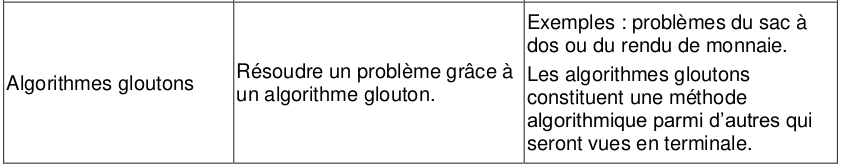
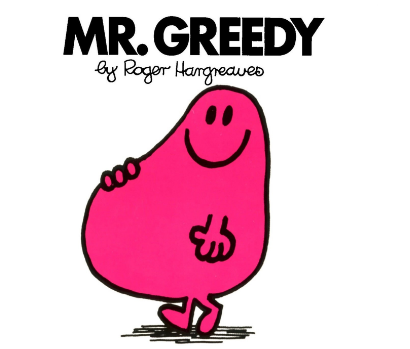
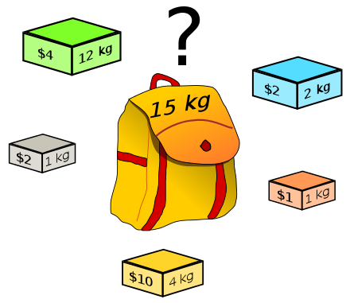
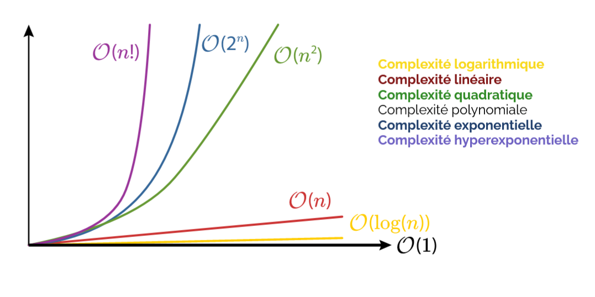

# Les algos Gloutons

*ou comment résoudre un problème en maximisant son gain ?*

{: .center}

{: .center}

!!! abstract "Définition :heart:"
    Un algorithme est qualifié de **glouton** si le problème qu'il essaie de résoudre est décomposé en une succession de problèmes identiques pour lesquels l'algorithme va chercher une solution optimale.  

La question (presque philosophique) est : 

*Lorsqu'on fait à chaque étape le meilleur choix possible, est-ce que la solution finale à laquelle on arrive est la meilleure possible ?*

Formulé autrement :

*Est-ce que faire le meilleur choix à chaque étape nous assure le meilleur choix global ?*

# Algorithmie "Classique"

Il existe dans la littérature informatique deux problèmes classiques, dont les informaticiens ont essayé de généraliser la résolution.

## Le rendu de monnaie

{: .center width=50%}

Le problème du rendu de monnaie s’énonce de façon simple : étant donné un ensemble de pièces à disposition (je ne peux rendre que des pièces de 50 centimes, 1 euro, 2 euros…) et un montant à rendre, rendre ce montant avec un <u>nombre minimal de pièces</u> du système que l’on s’est donné. Les applications d’une solution à ce problème sont faciles à imaginer : nul n’a envie de récupérer 1 euro en pièces de 1 centime s’il s’est aventuré à payer 2 euros pour une malheureuse bouteille de soda à un distributeur !!

Lien vers l'article de [Wikipedia](https://fr.wikipedia.org/wiki/Probl%C3%A8me_du_rendu_de_monnaie) 


## le sac à dos

{: .center width=50%}

Lien vers l'article de [Wikipedia](https://fr.wikipedia.org/wiki/Probl%C3%A8me_du_sac_%C3%A0_dos) :

En algorithmique, le problème du sac à dos, noté également KP (en anglais, Knapsack problem) est un <u>problème d'optimisation combinatoire</u>. ... 
Ou plus simplement, les objets mis dans le sac à dos doivent maximiser la valeur totale, sans dépasser le poids maximum.

[Télécharger Notebook](./data/gloutons.zip){. target="_blank" .md-button }

# La NASA

Vous faites partie de l'équipage d'un vaisseau spatial qui doit rejoindre une base installée sur la face visible de la Lune. Mais, suite à un certain nombre de problèmes, vous êtes contraints de vous poser en catastrophe, à 320 km du point prévu. 

{: .center width=50%}

Au cours de cet alunissage d'urgence, la plupart des équipements de bord de votre vaisseau sont endommagés, à l'exclusion de vos scaphandres de sortie dans l'espace et de quinze objets cités ci-dessous.

Il s'agit donc pour votre équipage de rejoindre la base lunaire au plus vite en emportant le strict minimum avec vous. Vous ne pouvez emmener que 10 objets parmi les 15 cités ci -dessous.

- Une boîte d’allumettes
- Des aliments concentrés
- 50 mètres de corde en nylon
- Un parachute en soie
- Un appareil de chauffage fonctionnant sur l’énergie solaire
- Deux pistolets calibre 45
- Une caisse de lait en poudre
- Deux réservoirs de 50 kg d’oxygène chacun
- Une carte céleste des constellations lunaires
- Un canot de sauvetage autogonflable
- Un compas magnétique
- 25 litres d’eau
- Une trousse médicale et des seringues hypodermiques
- Des signaux lumineux
- Un émetteur-récepteur fonctionnant sur l’énergie solaire

Pour résoudre le dilemne posé, une solution serait d'attribuer une "valeur" numérique à chaque objet. La valeur la plus forte est donnée pour l'objet de plus grande importance, et la valeur la plus faible à l'objet de moindre importance.

> Classez les objets ci dessous pour ordre de valeur, le 15ème ayant le plus d'importance vitale (selon vous !)

|Nom de l'objet|Valeur|
|:--:|:--:|
| Une boîte d’allumettes||
| Des aliments concentrés||
| 50 mètres de corde en nylon||
| Un parachute en soie||
| Un appareil de chauffage fonctionnant sur l’énergie solaire||
| Deux pistolets calibre 45||
| Une caisse de lait en poudre||
| Deux réservoirs de 50 kg d’oxygène chacun||
| Une carte céleste des constellations lunaires||
| Un canot de sauvetage autogonflable||
| Un compas magnétique||
| 25 litres d’eau||
| Une trousse médicale et des seringues hypodermiques||
| Des signaux lumineux||
| Un émetteur-récepteur fonctionnant sur l’énergie solaire||

??? tips "Correction"

    |Nom de l'objet|Valeur|
    |:--:|:--:|
    | Une boîte d’allumettes|1|
    | Des aliments concentrés|12|
    | 50 mètres de corde en nylon|10|
    | Un parachute en soie|8|
    | Un appareil de chauffage fonctionnant sur l’énergie solaire|3|
    | Deux pistolets calibre 45|5|
    | Une caisse de lait en poudre|4|
    | Deux réservoirs de 50 kg d’oxygène chacun|15|
    | Une carte céleste des constellations lunaires|13|
    | Un canot de sauvetage autogonflable|7|
    | Un compas magnétique|2|
    | 25 litres d’eau|14|
    | Une trousse médicale et des seringues hypodermiques|9|
    | Des signaux lumineux|6|
    | Un émetteur-récepteur fonctionnant sur l’énergie solaire|11|


    :eyes: Pour les curieux, le classement selon la nasa est [ici](https://www.lumni.fr/article/jouer-a-survivre-sur-la-lune) 

!!! example "structure"

    **Quelle(s) structure(s) algorithmique(s), vous paraissent pertinentes pour enregistrer vos valeurs ?**

    - Codez l'une de vos solutions. <br />
    - En vous aidant de la documentation Python, trier les par ordre décroissant de leur "valeur" (vous pouvez utiliser la fonction `sort` ou `sorted`de Python).

??? tips "Correction"

    ```python
    #*complétez ici votre sructure de données.*

    # J'ai choisi ici une liste de dictionnaire.
    #Chaque dictionnaire représente un des objet NASA, pour chacun d'entre eux, 
    #on note dans 'objet' le nom de l'objet et dans 'valeur' sa valeur attribuée.
    liste=[{'objet': 'allumettes', 'valeur': '01'}, 
            {'objet': 'aliments', 'valeur': '12'},
            {'objet': 'corde', 'valeur': '10'}, 
            {'objet': 'parachute', 'valeur': '08'}, 
            {'objet': 'chauffage', 'valeur': '03'}, 
            {'objet': 'pistolets', 'valeur': '05'},
            {'objet': 'lait', 'valeur': '04'}, 
            {'objet': 'oxygène', 'valeur': '15'}, 
            {'objet': 'carte', 'valeur': '13'}, 
            {'objet': 'canot', 'valeur': '07'}, 
            {'objet': 'compas', 'valeur': '02'}, 
            {'objet': 'eau', 'valeur': '14'}, 
            {'objet': 'seringues', 'valeur': '09'}, 
            {'objet': 'signaux', 'valeur': '06'}, 
            {'objet': 'emetteur', 'valeur': '11'}]

    #*Trier votre structure par ordre décroissant de la valeur
    liste_ordo =sorted(liste, key=lambda d: d["valeur"], reverse=True)

    #Autre solution plus simple (!) avec un dictionnaire.
    nasa = {"allumette":1, 'carte': 13, 'emetteur':11}
    nasa_trie= sorted(nasa.items(), key=lambda t: t[1], reverse=True)
    ```

Revenons à notre résolution de problème, c'est à dire trouver les "meilleurs" objets pour la survie.

<u>Idée :</u> La solution optimum est de prendre les :keycap_ten: valeurs les plus fortes. 

!!! example "tri" 
    Codez l'affichage de vos 10 valeurs les plus fortes.

??? tips "correction"

    ```python linenums='1'
    liste_sel = []
    for i in range(10):
        liste_sel.append(liste_ordo[i]['objet'])
    print(liste_sel)
    ```

Mais si l'on rajoute une contrainte de poids ? Les astronautes ne peuvent emporter que 200 kg de matériel. 

|Nom de l'objet|Valeur|Poids en kg|
|:--:|:--:|:--:|
| Une boîte d’allumettes|1|0.1|
| Des aliments concentrés|12|2|
| 50 mètres de corde en nylon|10|5|
| Un parachute en soie|8|0.5|
| Un appareil de chauffage fonctionnant sur l’énergie solaire|3|25|
| Deux pistolets calibre 45|5|0.5|
| Une caisse de lait en poudre|4|5|
| Deux réservoirs de 50 kg d’oxygène chacun|15|100|
| Une carte céleste des constellations lunaires|13|0.1|
| Un canot de sauvetage autogonflable|7|100|
| Un compas magnétique|2|0.5|
| 25 litres d’eau|14|25|
| Une trousse médicale et des seringues hypodermiques|9|0.5|
| Des signaux lumineux|6|1|
| Un émetteur-récepteur fonctionnant sur l’énergie solaire|11|5|

!!! example "structure"

    En partant la structure suivante `nasa = {"allumette":1, 'carte': 13, 'emetteur':11}`, comment ajouter la notion de poids ?

??? tips "Correction"

        On peut utiliser un dictionnaire avec le nom de l'objet en clé et en valeur un tuple valeur/poids.

        ```
        nasa = {"allumettes" : (1, 0.1), "aliments" : (12, 2), "corde" : (10, 5), "parachute" : (8, 0.5), "chauffage" : (3, 25), "pistolets" : (5, 0.5), "lait" : (4, 5), "oxygène" : (15, 100), "carte" : (13, 0.1), "canot" : (7, 100), "compas" : (2, 0.5), "eau" : (14, 25)}

        ```

**Quelle serait alors la combinaison optimum pour maximiser ses chances de survie ?**

Plus difficile, non ? :skull:

## Formulation mathématique du problème du sac à dos 

Toute formulation commence par un énoncé des données. Dans notre cas, nous avons un sac à dos de poids maximal $W$ et $n$ objets. Pour chaque objet $i$, nous avons un poids $w_{i}$ et une valeur $w_{i}$.

Pour quatre objets ($n=4$) et un sac à dos d'un poids maximal de 30 kg ($W=30$), nous avons par exemple les données suivantes :</p>

|Objet|1|2|3|4|
|:--:|:--:|:--:|:--:|:--:|
|$p_{i}$|7|4|3|3|
|$w_{i}$|13|12|8|10|

Ensuite, il nous faut définir les variables qui représentent en quelque sorte les actions ou les décisions qui amèneront à trouver une solution. On définit la variable $x_{i}$ associée à un objet $i$ de la façon suivante : $x_{i}=1$ si l’objet $i$ est mis dans le sac, et $x_{i}=0$ si l’objet $i$ n’est pas mis dans le sac.

Dans notre exemple, une solution réalisable est de mettre tous les objets dans le sac à dos sauf le premier, nous avons donc : 
$x_{1}=0$, $x_{2}=1$, $x_{3}=1$, et $x_{4}=1$.</p>

Puis il faut définir les contraintes du problème. Ici, il n'y en a qu’une : la somme des poids de tous les objets dans le sac doit être inférieure ou égale au poids maximal du sac à dos.

Cela s’écrit : $x_{1}*w_{1}+x_{2}*w_{2}+x_{3}*w_{3}+x_{4}*w_{4} <= W$

ou plus généralement pour $n$ objets : $\sum_{i=1}^{n} x_{i}*w_{i} \le W$<br />
    
Pour vérifier que la contrainte est respectée dans notre exemple, il suffit de calculer cette somme : $0 × 13 + 1 × 12 + 1 × 8 + 1 × 10 = 30$, ce qui est bien inférieur ou égal à 30, donc la contrainte est respectée. Nous parlons alors de solution réalisable. <br />
:bangbang: Mais ce n’est pas nécessairement la meilleure solution.<br />
Enfin, il faut exprimer la fonction qui traduit notre objectif : **maximiser la valeur totale des objets dans le sac**.<br />
Pour $n$ objets, cela s’écrit : $Max \sum_{i=1}^{n} x_{i}*w_{i}$ <br />
    
Dans notre exemple, la valeur totale contenue dans le sac est égale à $10$. Cette solution n’est pas la meilleure, car il existe une autre solution de valeur plus grande que $10$ : il faut prendre seulement les objets $1$ et $2$ qui donneront une valeur totale de $11$. Il n’existe pas de meilleure solution que cette dernière, nous dirons alors que cette solution est **optimale**.

## Résolution algorithmique - Force brut

Dans un problème d'optimisation chaque solution possède une valeur, et on cherche à déterminer parmi toutes les solutions celle dont la valeur est optimale.

La technique la plus basique pour résoudre ce type de problème consiste à énumérer de façon exhaustive toutes les solutions possibles, puis à choisir la meilleure. Cette approche est nommée par **force brute**.

Vous trouverez ci dessous un extrait du code de résolution du problème de la NASA par force brut.

??? note "Code par force brute"

    ```python linenums='1'
        # Structure contenant les objets de la NASA
        dicoNasa2 = {"allumettes" : (1, 0.1), "aliments" : (12, 2), "corde" : (10, 5), "parachute" : (8, 0.5), "chauffage" : (3, 25), "pistolets" : (5, 0.5), "lait" : (4, 5), "oxygène" : (15, 100), "carte" : (13, 0.1), "canot" : (7, 100), "compas" : (2, 0.5), "eau" : (14, 25)}

        #Initialisation des variables
        # stockage de la meilleure solution
        meilleur_valeur=0
        # stockage de la meilleure combinaison
        meilleur_comb=""
        # stockage du meilleur poids
        meilleur_poids=0

        """
        Paramètres de contrainte de l'algorithme du sac à dos
            - poids_max : poids maximum autorisé
            - max_objets : nombre maximum d'objets autorisés
        """
        # poids maximum autorisé
        poids_max = 200
        # nombre maximum d'objets autorisés
        max_objets =10

        # Extraire les items du dictionnaire (liste de tuples (clé, valeur))
        items = list(dicoNasa2.items())

        # Générer toutes les combinaisons possibles de longueurs différentes
        for r in range(1, len(items) + 1):
            # On utilise itertools pour générer toutes les combinaisons possibles de i objets
            combinaisons = itertools.combinations(items, r)
            for combinaison in combinaisons:
                Comb = listeObjet2(combinaison)
                valeurs = sommeValeur2(combinaison)
                poids = sommePoids2(combinaison)
                # On affiche la combinaison, la valeur et le poids 
                print(Comb,' ',valeurs,' ',poids,'\n')
                # On ne garde que les combinaisons qui respectent les contraintes
                # dans notre cas : pas plus de 10 objets pour un poids inférieur à 200  
                if valeurs>meilleur_valeur and poids<=poids_max and len(combinaison)<=max_objets:
                    # solution retenue si surpasse la meilleure
                    meilleur_comb = Comb   # maj meilleure solution
                    meilleur_valeur = valeurs     # maj meilleure solution
                    meilleur_poids = poids        # maj meilleure solution

    ```
Le principe de la résolution par force brut est de générer toutes les combinaisons possibles. Puis de sélectionner uniquement celle qui maximise la valeur, tout en respectant les contraintes données. 

Pour résoudre cette problématique par force brute, la bibliothèque [itertools](https://docs.python.org/fr/3/library/itertools.html) pour générer toutes les combinaisons possibles.

```prompt
allumettes
allumettes\aliments
allumettes\corde
...
allumettes\aliments\corde
allumettes\aliments\parachute
...
```
!!! example "Question"
    Combien y a t'il de combinaisons possible ?

??? tips "Réponse"
    Au rang $1$ : on a $1$ éléments dans la liste, il y a $15$ combinaisons possibles.<br />
    Au rang $2$ : on a $2$ éléments dans la liste, il y a $105$ combinaisons possibles.(On ne compte pas les permutations : carte/eau est la même combinaison que eau/carte)<br />
    
    Au rang $p$ : cela fait appel à des notions mathématiques, non vu par vous en première.
    La formule est $\mathrm{C}_{n}^{p} = \frac{n!}{(n-p)!*p!}$ <br />

    où $p$ est le nombre d'objet dans la combinaison et $n$ le nombre total d'objet.<br />
    Avec cette formule, on obtient bien 105.<br />

    Ici, on cherche la somme de toutes ces combinaisons, et la formule est ici $2^{n}$.Donc $2^{15} = 32 768$

!!! example "Question"
    Que pouvez vous en déduire sur la complexité de l'algorithme par force brut ?

??? tips "Réponse"
    La complexite de l'algorithme brut du problème du sac à dos est de l'ordre de $2^{n}$

    | Temps |Type de complexité|Temps pour $n = 5$|Temps pour $n = 10$|	Temps pour $n = 20$|	Temps pour $n = 50$|	Temps pour $n = 250$|	 Temps pour $n = 1 000$|Temps pour $n = 10 000$	|Temps pour $n = 1 000 000$|	Problème exemple|
    ||||||||||||
    |$\displaystyle O\left(2^{\rm {{poly}(n)}}\right)$ |	complexité exponentielle |	320 ns |10 µs |	10 ms |130 jours |$\displaystyle 10^{59}$ ans	|... |	...	 |... |	problème du sac à dos par force brute |

    [Source wikipedia](https://fr.wikipedia.org/wiki/Analyse_de_la_complexit%C3%A9_des_algorithmes)


??? info "Code par force brut complet"

    ```python linenums='1'
        import itertools

        def listeObjet2(liste):
            """
            Afffiche la liste des objets à partir d'un dictionnaire 
            :param dico: liste de tuples
            exemple : (('allumettes', (1, 0.1)),)
            :return --> str: retourne la liste des objets
            """
            l = ""
            for objet in liste :
                l += objet[0]+str("/")
            return l

        def sommeValeur2(liste):
            """
            Calcule la valeur totale de la liste d'objets
            :param dico: liste de tuples
            exemple : (('allumettes', (1, 0.1)),)
            :return -> int: retourne la valeur totale de la liste d'objets passée en paramètre
            """
            force = 0
            for objet in range(len(liste)):
                force += int(liste[objet][1][0])
            return force
            
        def sommePoids2(liste):
            """"
            Calcule le poids total de la liste d'objets
            :param dico: liste de tuples
            exemple : (('allumettes', (1, 0.1)),)
            :return -> float: retourne le poids total    
            """
            cout = 0
            for objet in range(len(liste)):
                cout += float(liste[objet][1][1])
            return cout 
        """
        PROGRAMME PRINCIPAL
        note : 
            Il existe de nombreuses manière de coder la force brut.
            Il s'agit ci dessous de l'une de ces versions en utilisant la bibliothèqye itertools pour générer 
            toutes les combinaisons possibles de l'ensemble des objets. 
        """
        # Ouverture du fichier contenant les objets de la NASA
        dicoNasa2 = {"allumettes" : (1, 0.1), "aliments" : (12, 2), "corde" : (10, 5), "parachute" : (8, 0.5), "chauffage" : (3, 25), "pistolets" : (5, 0.5), "lait" : (4, 5), "oxygène" : (15, 100), "carte" : (13, 0.1), "canot" : (7, 100), "compas" : (2, 0.5), "eau" : (14, 25)}

        #Initialisation des variables
        # stockage de la meilleure solution
        meilleur_valeur=0
        # stockage de la meilleure combinaison
        meilleur_comb=""
        # stockage du meilleur poids
        meilleur_poids=0

        """
        Paramètres de contrainte de l'algorithme du sac à dos
            - poids_max : poids maximum autorisé
            - max_objets : nombre maximum d'objets autorisés
        """
        # poids maximum autorisé
        poids_max = 200
        # nombre maximum d'objets autorisés
        max_objets =10

        #version 2 en utilisant un dictionnaire
        # On génère toutes les combinaisons possibles de i objets (1 objet, 2 objets, 3 objets, etc)


        # Extraire les items du dictionnaire (liste de tuples (clé, valeur))
        items = list(dicoNasa2.items())

        # Générer toutes les combinaisons possibles de longueurs différentes
        for r in range(1, len(items) + 1):
            # On utilise itertools pour générer toutes les combinaisons possibles de i objets
            combinaisons = itertools.combinations(items, r)
            for combinaison in combinaisons:
                Comb = listeObjet2(combinaison)
                valeurs = sommeValeur2(combinaison)
                poids = sommePoids2(combinaison)
                # On affiche la combinaison, la valeur et le poids 
                print(Comb,' ',valeurs,' ',poids,'\n')
                # On ne garde que les combinaisons qui respectent les contraintes
                # dans notre cas : pas plus de 10 objets pour un poids inférieur à 200  
                if valeurs>meilleur_valeur and poids<=poids_max and len(combinaison)<=max_objets:
                    # solution retenue si surpasse la meilleure
                    meilleur_comb = Comb   # maj meilleure solution
                    meilleur_valeur = valeurs     # maj meilleure solution
                    meilleur_poids = poids        # maj meilleure solution

        print(f"La meilleure sélection est {meilleur_comb} ; valeur = {meilleur_valeur}; poids = {meilleur_poids}")
    ```

## Résolution algorithmique - Algorithme glouton

### cours : principes et définitions

Les algorithmes gloutons sont des algorithmes assez simples dans leur logique. Ainsi que leur nom le suggère, ils sont conçus pour prendre le maximum de ce qui est disponible à un moment donné.<br />

L’algorithme glouton choisit la **solution optimale** qui se présente à lui à chaque instant, sans se préoccuper, ni du passé ni de l’avenir. Il répète cette même stratégie à chaque étape jusqu’à avoir entièrement résolu le problème. <br />

!!! note "Définition"
    Un algorithme glouton est un algorithme qui effectue à chaque instant, le meilleur choix possible sur le moment, sans retour en arrière ni anticipation des étapes suivantes, dans l’objectif d’atteindre au final un résultat optimal.<br />

Les algorithmes gloutons sont parfois appelés algorithmes gourmands ou encore algorithmes voraces.<br />
La **répétition** de cette stratégie très simple, permet de résoudre rapidement et de manière souvent satisfaisante des problèmes d’optimisation sans avoir à tester systématiquement toutes les possibilités.

```prompt
Pseudo Algorithme :
DEBUT
    calculer la valeur (pi / wi) pour chaque objet i,
    trier tous les objets par ordre décroissant de cette valeur,
    sélectionner les objets un à un dans l’ordre du tri et ajouter l’objet sélectionné dans le sac si le poids maximal reste respecté.
FIN
```
??? info "Code par la méthode gloutonne."

    ```python linenums='1'  
        # Ouverture du fichier contenant les objets de la NASA
        dicoNasa2 = {"allumettes" : (1, 0.1), "aliments" : (12, 2), "corde" : (10, 5), "parachute" : (8, 0.5), "chauffage" : (3, 25), "pistolets" : (5, 0.5), "lait" : (4, 5), "oxygène" : (15, 100), "carte" : (13, 0.1), "canot" : (7, 100), "compas" : (2, 0.5), "eau" : (14, 25)}

        #Initialisation des variables
        # stockage de la meilleure solution
        meilleur_valeur=0
        # stockage de la meilleure combinaison
        meilleur_comb=[]
        # stockage du meilleur poids
        meilleur_poids=0

        """
        Paramètres de contrainte de l'algorithme du sac à dos
            - poids_max : poids maximum autorisé
            - max_objets : nombre maximum d'objets autorisés
        """
        # poids maximum autorisé
        poids_max = 200
        # nombre maximum d'objets autorisés
        max_objets =10

        # on trie la liste des objets par force décroissante  
        nasa_ordo = sorted(dicoNasa2.items(), key=lambda x: x[1][0], reverse=True)
        #ATTENTION : changement de la structure de la liste 
        #nasa_ordo = [('oxygène', (15, 100)), ('eau', (14, 25)), ('carte', (13, 0.1)), ('aliments', (12, 2)), ('corde', (10, 5)), ('parachute', (8, 0.5)), ('canot', (7, 100)), ('pistolets', (5, 0.5)), ('lait', (4, 5)), ('chauffage', (3, 25)), ('compas', (2, 0.5)), ('allumettes', (1, 0.1))]

        # on balaye sequentiellement la liste triée nasa_ordo
        for objet in nasa_ordo:  
            # on accumule tant que cela ne va pas dépasser le budget Poids
            # et que l'on ne dépasse pas le nombre d'objet, fixé à 10 par nos contraintes
            if (meilleur_poids + float(objet[1][1])) <= poids_max and len(meilleur_comb)<max_objets: 

                meilleur_valeur += int(objet[1][0])  #calcul valeur gagnée
                meilleur_comb.append(objet[0]) #complément liste des recrues
                meilleur_poids += float(objet[1][1])  #calcul poids "dépensées"

        #Affichage du résultat
        print ("somme des valeurs : ",meilleur_valeur)
        print ("nombre d'objet : ",)
        print ("poids total : ",meilleur_poids)
        print (f"liste des {len(meilleur_comb)} objets : {meilleur_comb}")
    ```

!!! example "Question"
    L'exécution du programme est il plus rapide ?

??? tips "Réponse"
    La méthode par glouton est beaucoup plus rapide.

## Complexité

**Algorithme force brute** : On trouve dans le programme une  boucle dont la limite dépend de $n$, on y imbrique une itération.<br />
- pour le pointeur $i$ la gamme (range) est $n^{2}$, parcours de toute la liste<br />
- pour le pointeur $p$ la gamme est $n$, nombre de combinaisons possibles<br />
On peut conclure que le complexité de l’algorithme est $O(n^{3})$ <br />
La complexité en temps croît donc rapidement **très** supérieur pour l’algorithme force brute<br />

**Algorithme glouton** : seules les lignes 24 à 30 contiennent des opérations dont le nombre dépend de $n$ (longueur de la liste ) si on néglige l’import préalable du fichier .csv<br />
On distingue : <br />
- le tri préalable de la liste selon le critère de valeur dont la complexité est $O(nlog(n))$<br />
- puis le parcours de cette liste triée dont la complexité est $O(n)$ au pire cas<br />
    
On peut conclure que le complexité de l’algorithme entier est $O(n(log(n)+1)$ qui tend vers une complexité standard $O(nlog(n))$ si $n$ est grand

{: .center width=60%}

<p style="padding:5px;color:red;text-align:center;font-weight: bold;font-size:20px;">!!! Un algorithme glouton ne fournit pas toujours le meilleur résultat possible !!!</p>

### Cas d'usage des algorithmes gloutons

Les algorithmes gloutons sont souvent employés pour résoudre des **problèmes d’optimisation**. <br />

- déterminer le plus court chemin dans un réseau<br />
- optimiser la mise en cache de données<br />
- compresser des données<br />
- organiser au mieux le parcours d’un voyageur visitant un ensemble de villes<br />
- organiser au mieux des plannings d’activité ou d’occupations de salles.<br />

!!! example "Source" 
    - [pixees](https://pixees.fr/informatiquelycee/n_site/nsi_prem_glouton_algo.html)
    - [wikipedia](https://fr.wikipedia.org/wiki/Probl%C3%A8me_du_sac_%C3%A0_dos)
    - [Fiche cours schoolmouv](https://www.schoolmouv.fr/cours/algorithmes-gloutons/fiche-de-cours)
    - [Fiche interstice sur le sac à dos](https://interstices.info/le-probleme-du-sac-a-dos/)
    - PrépaBac hatier : Algorithme glouton sur le rendu de monnaie
    - "Programmation efficace" aux éditions Ellipses
    - [Lumni : survivre sur la lune](https://www.lumni.fr/article/jouer-a-survivre-sur-la-lune)
    - [site du zéro : fiche sac à dos](http://sdz.tdct.org/sdz/les-algorithmes-gloutons.html)
    - [Gilles Glassus - académie de Bordeaux](https://glassus.github.io/premiere_nsi/T4_Algorithmique/4.6_Algorithmes_gloutons/cours/)