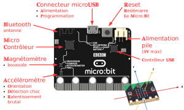
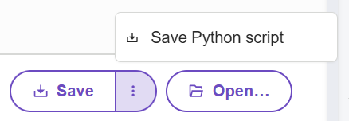
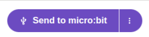

# Activité 1 : Qu'est-ce que Micro-Bit ?

## 1. Un micro-contrôleur...

Dans un format réduit qui tient dans une main (52×42 mm), ce micro-contrôleur est une carte électronique programmable pour interagir avec le monde réel.

C'est une version simplifiée et accessible de l'électronique que tout un chacun peut manipuler au quotidien.

{: .center width=50%}

Elle contient :

- 25 DELs,
- deux boutons A et B programmables,
- un bouton de réinitialisation,
- des capteurs de lumière et de température,
- des capteurs de mouvements (accéléromètre et boussole),
- des broches de connexion.

Les programmes se transfèrent dans la carte depuis un ordinateur à l'aide d'un câble USB connecté au port micro-USB ou sans fil par Bluetooth.

## 2. Les composants et les instructions d'une carte programmable

Pour programmer ce type de carte, on peut utiliser, au choix, 2 langages de programmation :

- un langage de programmation par blocs (Makeblock), cela ressemble à Scratch
- un langage textuel : Python.

Au lycée, nous utiliserons ce dernier ; voici donc quelques commandes que nous pourrons utiliser dans nos programmes :

|Instructions Python|Description de l'instruction|
|:--:|:--:|
|from microbit import *|Bibliothèque d'instructions de la carte micro-bit|
|display.scroll()|Faire défiler la chaîne de caractère sur l'afficheur 25 DEL|
|display.show()|Affiche une image à l'aide des 25 DEL|
|display.clear()|Éteint les 25 DEL|
|button_a.is_pressed()|Teste si le bouton A a été pressé|
|button_b.is_pressed()|Teste si le bouton B a été pressé|
|button_a.get_presses()|Compte le nombre de fois que le bouton A a été pressé|
|display.set_pixel(x,y,val)|Allume (val=9) ou éteint (val=0) la DEL qui se trouve en x et y|
|gesture = accelerometer.current_gesture()|Affecte la position courante de la carte microbit dans la variable gesture|

## 3. Mise en place de l'environnement de travail

!!! note "Mise en place"

    Créer un dossier **SNT** dans le cloud de votre ecole directe.<br />
    Créer un sous-dossier **Robotique**. Dans ce dossier, vous veillerez à enregistrer vos programmes.

    Dans votre navigateur préféré, ouvrez le site : [https://python.microbit.org](https://python.microbit.org/v/3){target="_blank"}

### 3.1 Un premier programme

Remplacez le code existant par le code suivant.

On ferra attention à respecter la casse (minuscules/majuscules) et les espaces. ctrl+C pour copier, ctrl+V pour coller.

```python linenums='1'
from microbit import *
display.show(Image.HAPPY)
```
On notera qu'un programme pour carte **micro:bit** commence toujours avec cette ligne : ``from microbit import *``. Cela permet d'importer les bibliothèques **micro:bit** et ainsi pouvoir interagir avec la carte.

### 3.2 Enregistrer son travail

Comme vous pouvez les remarquez, on travaille en ligne sans se connecter. Ce qui veut dire que le travail n'est sauvegardé nul part. Or il peut être souhaitable de l'enregistrer pour y revenir plus tard (d'où la création du dossier *Robotique* sur votre cloud d'ED)

!!! note "Pour Enregistrer"

    1. Cliquez sur les 3 petits points à côté de save (en bas à droite)<br />
    2. Choisissez **Save Python script**<br />
    3. Nommez votre projet au besoin. Par exemple ici "Happy"<br />
    4. Déplacez le fichier téléchargé dans vôtre dossier **Robotique**<br />

    {: .center width=50%}

En utilisant le bouton Open..., juste à coté vous pourrez rouvrir votre travail dans le futur.

### 3.3 Transférer son travail sur la carte

Il est l'heure maintenant de mettre ce petit programme sur notre carte. Pour être "activer" sur la carte micro:bit, il faut télécharger sur la carte un fichier avec l'extension ``.hex``. Pour ce faire nous avons deux méthodes.

!!! tip "La version simple mais qui fonctionne rarement"

    {: .center width=50%}

    1. Branchez la carte à l'ordinateur à l'aide du câble USB fourni ;
    2. Sur le site, cliquez sur le bouton Send to micro:bit (en bas à gauche) ;
    3. Suivez le protocole indiqué.
    4. Si quelque chose échoue, utilisez la solution suivante

!!! tip "La version compliquée mais infaillible (ou presque)"

    {: .center width=50%}

    1. Branchez la carte à l'ordinateur à l'aide du câble USB fourni ;
    2. Sur le site, cliquez sur le bouton Save (en bas à droite) ;
    3. Regarder dans votre explorateur de fichier, dans "Téléchargement"
    4. Copiez le fichier ainsi téléchargé sur la carte
        > Si la copie échoue réessayez.
        > Si le problème persiste, appelez le·a professeur·e

## 4. Découverte de la programmation

Dans la partie précédente, nous avons découvert comment écrire créer et transférer un programme sur la carte.<br />
Maintenant, il serait temps de créer nos propres programmes.

!!! question "Programme 1 : Smiley"

    Dans la partie précédente, nous avons affichez un smiley joyeux 😊 sur la carte. Mais ce n'est pas la seule image possible. Affichez une image **de votre choix.**
 
    ??? tip "Indice"
        On peut trouver les différentes images possibles dans la [documentation python](https://microbit-micropython.readthedocs.io/en/latest/tutorials/images.html).
    
    👍 Appelez l'enseignant pour validation ❗

!!! question "Programme 2 : HAPPY"

    On souhaite désormais afficher un texte "Happy" avant d'afficher le smiley 😊. Modifier votre programme précédent afin d'afficher le texte avant l'image de votre choix.

    👍 Appelez l'enseignant pour validation ❗

    ??? tip "Indice"
        Il existe 2 méthodes avec les cartes pour afficher du texte.

        La fonction ``show`` qui affiche les lettres les unes après les autres : ``display.show("Happy")`` <br />
        La fonction ``scroll`` qui fait défiler le texte : ``display.scroll("Happy")``

!!! question "Programme 3 : Wait"

    On souhaite maintenant attendre 2 secondes avant d'afficher le smiley. Modifier votre programme afin d'attendre 2 secondes entre la fin du texte et l'affichage du smiley 😊.

    👍 Appelez l'enseignant pour validation ❗

    ??? tip "Indice"
        La fonction sleep, permet de suspendre le programme pour un nombre définit de millisecondes.

        ```python linenums="1"
        # Attend (ne fait rien) pendant 1.5 secondes
        sleep(1500)
        ```

!!! question "Programme 4 : Boucle"

    On aimerait désormais afficher cette séquence (Happy + smiley) en boucle à l'infini. Modifiez votre programme afin de faire une boucle infinie.

    👍 Appelez l'enseignant pour validation ❗

    ??? tip "Indice"
        L'instruction while permet de faire des boucles, i.e. de répéter une action.<br />
        Le code suivant affiche à l'infini une alternance de smiley joyeux et triste.

        ```python linenums="1"
        while True:
            display.show(Image.HAPPY)
            sleep(1500)
            display.show(Image.SAD)
            sleep(1500)
        ```