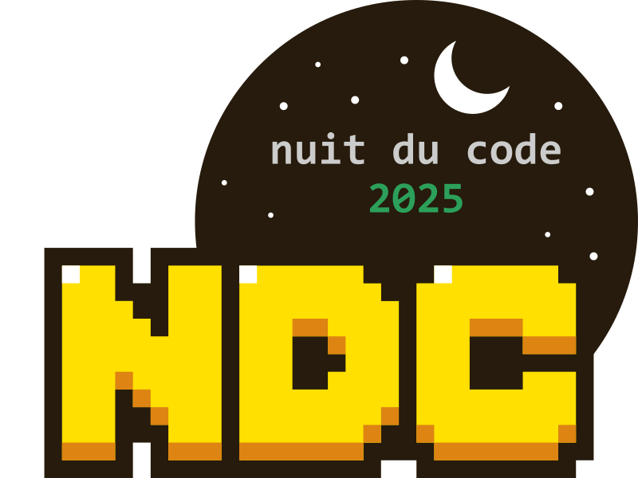

 Projet Pyxel 🔣

{: width=50% .center}

## 1. Prise en main Pyxel
▶️[tutoriel à suivre : 1er pas avec Pyxel](https://nuit-du-code.forge.apps.education.fr/DOCUMENTATION/PYTHON/TUTORIELS/1-premiers-pas-avec-pyxel-premiere/)

▶️[environnement de codage : cahier du numérique](https://www.cahiernum.net/J682W5)

^^note :^^ Nous réutiliserons l'environnement pyxel en debut d'année prochaine pour un [projet de Terminale](https://sofaugeras.github.io/TNSI/T8_projet/1_POO/cours/) mais en incluant un autre paradigme de programation la **POO**. Mais en attendant, on reste au niveau première en utilisant le paradigme de programmation **impératif**.

## 2. Consignes

!!! abstract "Consignes"
    Créer un jeu vidéo de type "tir" sur pyxel en vous inspirant d'un jeu existant.

    ^^Minima attendu :^^

    - une autre action ou capacité
    - Un score ou un timer
    - Une animation ou customisation de l'interface du jeu

!!! tip "Quelques idées"

    - bouger des bulles de couleur qui doivent éviter les collisions
