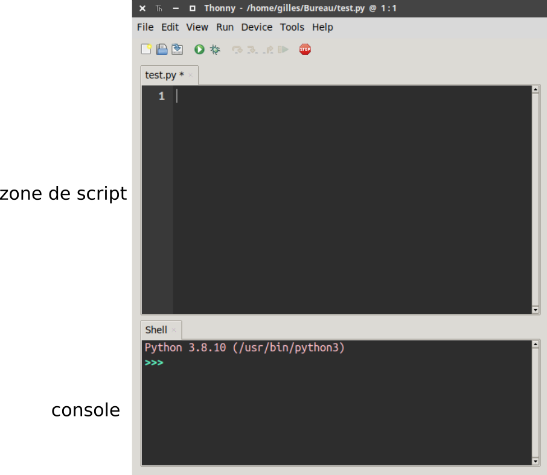

# Vos outils pour coder en Python

!!! info "Crédit"
    Page inspirée du document "Découverte de Thonny" de Didier Berhault, Lycée Marcellin Berthelot, Questembert.

Cette année, vous allez écrire et exécuter énormément de code Python. Pour cela, deux outils sont à votre disposition : **Thonny**, installé sur les ordinateurs du lycée, et **Basthon**, une alternative en ligne accessible depuis n'importe quel appareil. Cette page vous présente les deux.

## Thonny : l'IDE de référence au lycée

Thonny est un IDE (environnement de développement) au style épuré, pensé pour l'apprentissage. C'est lui que vous utiliserez principalement en classe.

{: .center width=50%}

Thonny est déjà installé sur les ordinateurs du lycée. Si vous souhaitez l'installer chez vous, il est gratuit et téléchargeable à cette adresse : [https://thonny.org](https://thonny.org)

### Les zones et boutons de Thonny

{: .center width=80%}

Thonny se compose principalement de deux zones, comme la plupart des IDE Python :

- une **zone de script** (ou éditeur), où l'on rédige son programme ;
- une **console**, où le programme s'exécute et où l'on peut faire des tests rapides.

!!! note "Affichage personnalisé"
    L'affichage de Thonny est personnalisable via le menu **Affichage**. Pensez à activer les fenêtres suivantes, très utiles en NSI : `Assistant`, `Console`, `Structure`, `Variables`.

### Installer une bibliothèque

!!! tip "Marche à suivre"
    Menu `Outils` > `Gérer les paquets` : tapez le nom de la bibliothèque souhaitée (exemple : `networkx`), cliquez sur « Rechercher sur PyPi », sélectionnez le premier lien proposé, puis cliquez sur « Installer ».

    {: .center width=100%}

    Si la bibliothèque est déjà installée, vous pouvez la « mettre à jour » (fortement conseillé en début d'année) ou la « désinstaller ».

## Basthon : coder en ligne, sans rien installer

[illustration](./data/basthon.png){: .center width=50%}

[Basthon](https://console.basthon.fr) est un projet libre et gratuit qui permet d'exécuter du Python **directement dans le navigateur**, sans aucune installation. Il reprend une organisation proche de Thonny, avec une zone de script et une console.

!!! abstract "Pourquoi Basthon peut être utile"
    - Vous travaillez sur un ordinateur personnel, une tablette ou un Chromebook sans Python installé.
    - Vous voulez juste tester rapidement un bout de code, sans ouvrir un IDE complet.
    - Une fois la page chargée, Basthon peut continuer à fonctionner **sans connexion internet**, ce qui le rend pratique en cas de coupure de réseau ou de wifi capricieux.

À savoir : votre code n'est pas sauvegardé automatiquement sur un serveur. Pensez à **exporter/télécharger votre fichier `.py`** régulièrement si vous travaillez sur Basthon, pour ne rien perdre.

## Thonny ou Basthon : lequel choisir ?

| | Thonny | Basthon |
|:--|:--:|:--:|
| Installation nécessaire | Oui | Non (navigateur seulement) |
| Disponible au lycée | Oui (déjà installé) | Oui |
| Utilisable chez soi sans rien installer | Non | Oui |
| Fonctionne hors connexion | Oui | Oui (après premier chargement) |
| Outil de référence en classe | :white_check_mark: | |

!!! example "En résumé"
    Utilisez **Thonny** comme outil principal, au lycée comme à la maison si vous l'installez. Gardez **Basthon** sous le coude pour dépanner : un appareil sans Python, un test rapide, ou un exercice à terminer sur un ordinateur qui n'est pas le vôtre.

Dans les deux cas, le raccourci `F5` exécute votre script : la logique de travail (écrire dans le script, tester en console) reste la même d'un outil à l'autre.
